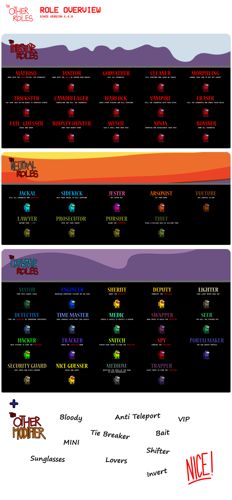

# 本家模组:[The Other Roles](https://github.com/TheOtherRolesAU/TheOtherRoles)

# 分支模组:[The Other Roles Edited](https://github.com/XtremeWave/TheOtherRolesEdited)

本模组不隶属于 Among Us 或 Innersloth LLC，其包含的内容也未得到 Innersloth LLC 的认可或以其他方式赞助。此处包含的部分材料是 Innersloth LLC 的财产 ©Innersloth LLC.

  致其他模组开发者:对于使用我们的代码，请阅读并遵守 <a href="#license">许可证</a>

# The Other Roles Edited
**The Other Roles Edited** 是一个为 [Among Us](https://store.steampowered.com/app/945360/Among_Us) 添加许多新职业的MOD

| 内鬼职业 | 船员职业 | 中立职业 | 附加职业 | 游戏模式 |
|----------|-------------|-----------------|----------------|----------------|
| 教父 (黑手党) | 市长 | 小丑 | 溅血者 | 经典模式 |
| 小弟 (黑手党) | 工程师 | 纵火犯 | 厄运儿 | 赌怪模式 |
| 清理者 (黑手党) | 警长 | 豺狼 | 破平者 | 捉迷藏模式 |
| 化形者 | 捕快 | 跟班 | 诱饵 | 原版躲猫猫模式 |
| 隐蔽者 | 执灯人 | 秃鹫 | 恋人 | 变形躲猫猫模式|
| 吸血鬼 | 侦探 | 律师 | 太阳镜 |
| 抹除者 | 时间之主 | 检察官 | 迷你船员 |
| 骗术师 | 医生 | 起诉人 | VIP |
| 清理者 | 换票师 | 窃贼 | 酒鬼 |
| 术士 | 灵媒 |  | 变色龙 |
| 赏金猎人 | 黑客 |  | 交换师 |
| 女巫 | 追踪者 |  | 分散者 |
| 忍者 | 告密者 |  |  |
| 爆破手 | 卧底 |  |  |
| 邪恶的赌怪 | 传送师 |  |  |
| 勒索者 | 保安 |  |
| 矿工 | 医生 |  |
| 悠悠球 |  猎人 |  |  |
| 送葬者 | 正义的赌怪 |  |  |
| | 老兵 | | | |
| | 被害妄想症 | | | |

# 下载
| Among Us - 版本| 模组版本 | 链接 |
|----------|-------------|-----------------|
| 17.0s| v1.3.1| [下载](https://github.com/XtremeWave/TheOtherRolesEdited/releases/download/v1.3.1/TheOtherRolesEdited.zip)
| 17.0s| v1.3.0| [下载](https://github.com/XtremeWave/TheOtherRolesEdited/releases/download/v1.3.0/TheOtherRolesEdited.zip)
| 17.0s| v1.2.9| [下载](https://github.com/XtremeWave/TheOtherRolesEdited/releases/download/v1.2.9/TheOtherRolesEdited.zip)

  
点我查看旧版本

  
| Among Us - 版本| 模组版本 | 链接 |
|----------|-------------|-----------------|
| 16.1.0s| v1.2.8| [下载](https://github.com/XtremeWave/TheOtherRolesEdited/releases/download/v1.2.8/TheOtherRolesEdited.zip)
| 16.1.0s| v1.2.7| [下载](https://github.com/XtremeWave/TheOtherRolesEdited/releases/download/v1.2.7/TheOtherRolesEdited.zip)
| 16.1.0s| v1.2.6| [下载](https://github.com/XtremeWave/TheOtherRolesEdited/releases/download/v1.2.6/TheOtherRolesEdited.zip)
| 2025.3.31s| v1.2.5.2| [下载](https://github.com/XtremeWave/TheOtherRolesEdited/releases/download/v1.2.5.2/TheOtherRolesEdited.zip)
| 2025.3.31s| v1.2.5.1| [下载](https://github.com/XtremeWave/TheOtherRolesEdited/releases/download/v1.2.5.1/TheOtherRolesEdited.zip)
| 2025.3.31s| v1.2.5| [下载](https://github.com/XtremeWave/TheOtherRolesEdited/releases/download/v1.2.5/TheOtherRolesEdited.zip)
| 2025.3.31s| v1.2.4| [下载](https://github.com/XtremeWave/TheOtherRolesEdited/releases/download/v1.2.4/TheOtherRolesEdited.zip)
| 2025.3.31s| v1.2.3| [下载](https://github.com/XtremeWave/TheOtherRolesEdited/releases/download/v1.2.3/TheOtherRolesEdited.zip)
| 2024.11.26s| v1.2.1| [下载](https://github.com/XtremeWave/TheOtherRolesEdited/releases/download/v1.2.1/TheOtherRolesEdited.zip)
| 2024.11.26s| v1.2.0| [下载](https://github.com/XtremeWave/TheOtherRolesEdited/releases/download/v1.2.0/TheOtherRolesEdited.zip)

# 部分代码参考来源

**我们在开发过程中引用过其他模组的相关代码并在此作出感谢。**
# 部分代码参考来源

**我们在开发过程中引用过其他模组的相关代码并在此作出感谢。**

本家模组是TORE的基础

部分UI代码引用

部分UI代码引用

部分职业代码引用

部分职业代码引用

部分UI & 车队姬 代码引用
